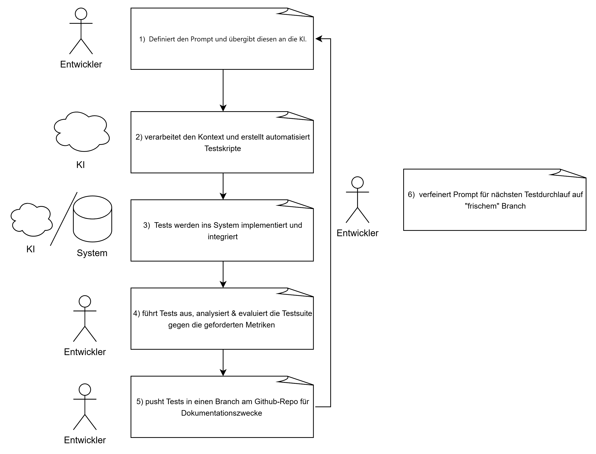

---

# Proposal: Evaluierung KI-generierter Test-Suites durch einen Single-Prompt in einer JavaScript-Anwendung

## 1. Ziel des Projekts (Goal of the Project)

### **Übergeordnetes Ziel und Validierung**
Das Hauptziel dieses Projekts ist die Evaluierung der Effektivität, Genauigkeit und Zuverlässigkeit von Unit- und Integration-Test-Suites, die vollständig von Large Language Models (LLMs) mithilfe eines einzigen, umfassenden & in der Komplexität steigenden Prompts generiert werden.

Wir werden dies anhand folgender Metriken validieren:

* **Code Coverage (Testabdeckung):** Der Prozentsatz der abgedeckten Anweisungen, Verzweigungen und Funktionen in der Zielanwendung (gemessen mit Tools wie Jest etc.).
* **Pass Rate (Erfolgsquote):** Das Verhältnis der auf Anhieb erfolgreich ausgeführten Tests im Vergleich zu jenen, die aufgrund von Halluzinationen, falschen Assertions oder Syntaxfehlern fehlschlagen.
* **Qualitative Code-Analyse:** Bewertung der Lesbarkeit, Wartbarkeit und der strukturellen Qualität der generierten Test-Suites. Hierbei wird insbesondere untersucht, inwieweit die KI das volle Potenzial und die spezifischen Features der eingesetzten Test-Frameworks ausschöpft.

* **Testrelevanz und Edge-Case-Abdeckung:** Eine Evaluierung der tatsächlichen Aussagekraft der implementierten Tests. Wir analysieren, wie hoch der Anteil an sinnvollen, praxisnahen Tests im Vergleich zu redundanten Prüfungen ist und ob die KI in der Lage ist, auch komplexe Sonderfälle (Edge Cases) systematisch zu erkennen und abzudecken.

### **Zu analysierendes System, Feature oder Workflow**
Wir analysieren den Workflow des **Agentic Coding** mit spezifischem Fokus auf das **Software Testing**. Als Testobjekt dient eine bestehende Vanilla-JavaScript-Frontend-Anwendung namens "WishList", ein WDP-Projekt aus dem WS 2025/26. Es handelt sich dabei um einen Wunschlisten-Manager, der mit einem Backend (localhost) kommuniziert und dynamische DOM-Manipulationen, asynchrone API-Aufrufe und lokales State-Management umfasst. Wir evaluieren, wie gut die KI den kombinierten Kontext versteht, um eine funktionsfähige Testumgebung aufzubauen.

### **Beitrag der KI-Unterstützung zum Entwicklungsprozess**
Anstatt dass menschliche Entwickler iterativ Tests schreiben, agiert die KI in der Post-Development-Phase als autonomer QA-Engineer. Wir werden die **Google Gemini CLI**, **ChatGPT / Codex**, etc.  verwenden, um aus einem einzigen Prompt vollständige Test-Suites (z. B. für Jest) zu generieren. Dies analysiert die Machbarkeit, die zeitaufwendige Testerstellung an die KI auszulagern, und untersucht, ob aktuelle Modelle die gesamte Anwendungslogik in einem einzigen Durchlauf fehlerfrei erfassen können.

### **Entwicklungs- und Architekturdiagramm**

---

## 2. Projektplan (Project Plan)

Hier ist die Aufgabenaufteilung und der vorläufige Zeitplan für das Projekt:

**Woche 1: Setup & Prompt Engineering**
* Einrichtung der lokalen Node.js-Testumgebung (Jest, Playwright, k6) für die WishBox-Anwendung. (S)
* Entwurf und Verfeinerung des "Single Prompts", der an die KI-Modelle übergeben wird. (C)
* Ausführung des Prompts über die Google Gemini CLI. (S) 
* Ausführung des Prompts über ChatGPT / Codex. (S) 
* Isolierung und Speicherung der roh generierten Test-Suites (ohne nachträgliche menschliche Anpassungen). (S)

**Woche 2: Ausführung & Erfassung der Metriken**
* erneute Ausführung der Test-Suites. (beide)
* Aufzeichnung der anfänglichen Pass/Fail-Raten und Testabdeckungsmetriken. (beide)
* Head-to-Head Gegenüberstellug der verschiedenen Modelle. (beide)
* Zusammenfassung der Erkenntnisse zur Machbarkeit von Single-Prompt-KI-Tests. (beide)
* Aufzeichnung der durch die KI gefundenen Bugs/Errors im gegebenen Quellcode (beide)
* Fertigstellung der Präsentation und Dokumentation. (beide)

---

## 3. Teamarbeit und Verantwortlichkeiten (Teamwork and Responsibilities)

* **Sanin Zimic:**
siehe oben (S)

* **Christoph Riedler:**
siehe oben (C)

* **Boban Vucetic:**
siehe oben (B)
